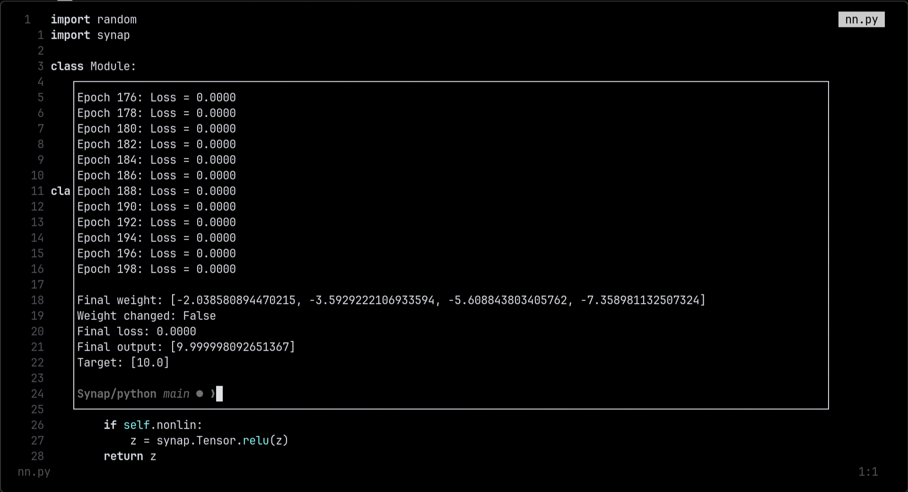

# Synap

A minimal deep learning framework written in C++ with Python bindings.



Synap is a from-scratch autograd engine and tensor library — think micrograd, but with a typed C++ core and a clean Python API via pybind11.

```
Synap/
├── src/
│   ├── synap/
│   │   ├── tensor.h / tensor.cpp   # Tensor ops + autodiff
│   │   ├── storage.h               # Shared float storage
│   │   └── scalar-based.h / scalar-based.cpp
│   └── bindings.cpp                # pybind11 module
├── python/
│   ├── nn.py                       # Neuron, Layer, MLP
│   ├── test_grad_descent.py
│   └── test_backwardpass.py
├── stubs/synap.pyi
├── docs/
│   ├── setup.md
│   ├── Tensors.md
│   └── Operations.md
└── CMakeLists.txt
```

---

## Build

```bash
cmake --preset setup
cmake --build build
```

See [`docs/setup.md`](docs/setup.md) for environment setup, Python version requirements, and virtual environment configuration.

---

## Quick Start

### Tensors

```python
import synap

a = synap.Tensor([3], requires_grad=True)
a.set_values([1.0, 2.0, 3.0])

b = synap.Tensor([3], requires_grad=True)
b.set_values([4.0, 5.0, 6.0])

loss = synap.Tensor.sum(synap.Tensor.add(a, b))
loss.backward()

print(a.grad_values)  # [1.0, 1.0, 1.0]
```

### Training a Neural Network

```python
import synap
import nn  # python/nn.py

x = synap.Tensor([1, 4], requires_grad=False)
x.set_values([1.0, 2.0, 3.0, 4.0])

y = synap.Tensor([1, 1], requires_grad=False)
y.set_values([10.0])

model = nn.MLP(4, [4, 1])
lr = 0.01

for _ in range(100):
    out = model(x)
    loss = synap.Tensor.mse(out, y)

    model.zero_grad()
    loss.backward()

    for param in model.parameters():
        vals = synap.tensor_data(param)
        grads = param.grad_values
        param.set_values([v - lr * g for v, g in zip(vals, grads)])
```

---

## Docs

- [`docs/setup.md`](docs/setup.md) — Build environment and CMake configuration
- [`docs/Tensors.md`](docs/Tensors.md) — Tensor internals: storage, strides, views, and the computation graph
- [`docs/Operations.md`](docs/Operations.md) — Full operations reference and autodiff rules

---

## License

MIT
